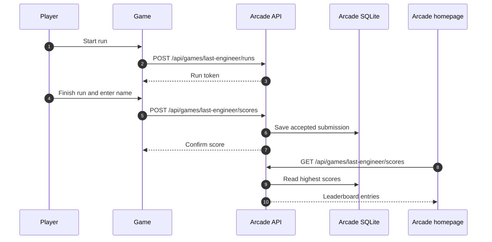
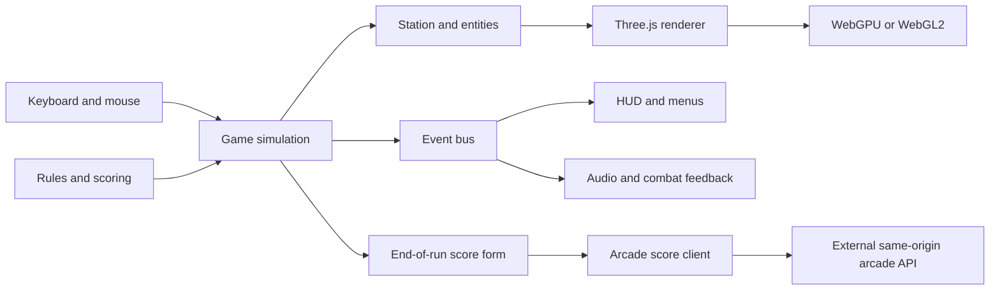

<p align="center">
  <a href="https://arcade.shoemoney.com/last-engineer/">
    
  </a>
</p>

# ShoeMoney Arcade: Last Engineer

<p align="center">
  <a href="https://arcade.shoemoney.com/last-engineer/"></a>
  
  
  <a href="LICENSE"></a>
</p>

**One engineer. No backup. The last train never stops.**

Fight through an overrun subway in a browser survival shooter built with Three.js. Land headshots, keep the kill chain alive, and put your name on the ShoeMoney Arcade leaderboard.

**[Test your skill](https://arcade.shoemoney.com/last-engineer/)** · **[Visit the arcade](https://arcade.shoemoney.com/)**

| Start playing | Build something | Understand the release |
| :--- | :--- | :--- |
| [Features](#inside-the-station) · [Controls](#controls) | [Quick start](#quick-start) · [Verification](#verification) | [Scores](#arcade-high-scores) · [Architecture](#architecture) · [Licensing](#public-source-and-live-arcade) |

## Inside the station

| Feature | What it brings to a run |
| :--- | :--- |
| Subway survival | Wave combat, station traversal, pickups, and the Conductor boss |
| Three weapons | Pistol, rifle, and shotgun with weapon mods and distinct handling |
| Weapon mods | Silencer, armor piercing, incendiary rounds, and laser sight; explosive rounds are removed |
| Wave supplies | At most one health heart and one armor chestplate per wave, at random vacant platform locations; old supplies are replaced and never respawn on a timer |
| Precision scoring | Hit-zone bonuses, timed kill chains, wave-clear rewards, and a no-damage wave bonus |
| Combat feedback | Headshot impacts, delayed casing sounds, a dedicated quiet suppressed pistol shot, and spoken award callouts synchronized with animated headings |
| Jeremy's voice | Narration, hurt reactions, “OHHH THAT’S THE STUFF!!!” for health, and “Armor Baby!” for armor; **Mute Jeremy** leaves weapons and award announcements active |
| Shared leaderboard | Optional name entry after a run, connected to the arcade's per-game leaderboard |
| Rendering | WebGPU first, a WebGL2 fallback, and low/medium/high quality tiers |
| Sharing | Custom favicon, touch icon, and Open Graph artwork |

## Controls

Designed for a desktop browser with a keyboard and mouse.

| Input | Action |
| :--- | :--- |
| WASD | Move |
| Mouse | Look after clicking the game to capture the pointer |
| Left mouse button | Fire |
| Shift | Sprint |
| Space | Jump |
| R | Reload |
| 1 / 2 / 3 | Select a weapon slot |
| Mouse wheel | Cycle weapons |
| Escape | Release the browser's captured pointer |

Click the game again to resume mouse look. Crouching is disabled in the current gameplay rules.

## Quick start

Use **Node.js 22.12 or newer** and npm.

```sh
git clone https://github.com/shoemoney/SMA-last-engineer.git
cd SMA-last-engineer
npm ci
npm run dev
```

Open **http://localhost:5173/**. A local clone is playable without the arcade backend; score submission needs the same-origin API described below.

```sh
npm test
npm run build
npm run preview
```

Preview serves the production build at **http://localhost:4173/**. Ports are strict: stop the process already using the port if startup reports a conflict.

<details>
<summary><strong>Static hosting and share metadata</strong></summary>

The build writes `dist/` and uses relative asset paths, so it can be hosted beneath `/last-engineer/` as well as at a site's root. The build checks emitted asset references for root-absolute paths that would break subdirectory hosting.

`SITE_URL` sets the absolute Open Graph and Twitter image URL at build time. Its default is `https://arcade.shoemoney.com/last-engineer/`. Set it to your own deployment directory when publishing a fork:

```sh
SITE_URL=https://example.com/last-engineer/ npm run build
```

The canonical link and `og:url` remain set in `index.html`; update those separately for a fork. This setting changes the share-image URLs, not the score API endpoint. Game assets resolve relative to the page; the arcade API deliberately lives at `/api/games/last-engineer/` on the same origin.

</details>

## Arcade high scores

At the end of a run, enter a **1–24 character display name** and submit, or start another run. The arcade homepage shows the game's **ten highest scores**, rather than the ten most recent submissions.

The deployed arcade owns the shared API and persistent SQLite database. **This repository contains the game and score client, not the arcade server.** A standalone static host does not create a leaderboard database automatically.



**Scores are client-reported.** Run tokens and duplicate-submission handling do not constitute authoritative anti-cheat verification. Keep database credentials and server secrets out of the game bundle.

<details>
<summary><strong>Score API contract and retry behavior</strong></summary>

| Request | Payload or response |
| :--- | :--- |
| `POST /api/games/last-engineer/runs` | Send `{}`; receive a `runToken` |
| `POST /api/games/last-engineer/scores` | Send `{runToken,name,score,wave,kills,headshots,duration}`; duration is in seconds |
| Successful score submission | `{accepted:true,score:{id,name,score,createdAt}}` |
| `GET /api/games/last-engineer/scores` | `{scores:[{id,name,score,createdAt}],order:"highest"}` |

The client freezes the run summary before submission. If a response is lost, it keeps the original payload and locks the name so a retry can check the same attempt. Rate-limited requests show a retry message; closed or expired runs require a new run. A response is only treated as success when it confirms the submitted name and score with a valid ID and timestamp.

The last successfully submitted display name is remembered in local storage. Local career progress and audio preferences also use local storage; none of those values substitutes for the shared leaderboard.

</details>

## Architecture



| Location | Responsibility |
| :--- | :--- |
| [`src/main.js`](src/main.js) | Boot, lifecycle wiring, and run summary integration |
| [`src/core/`](src/core/) | Renderer, input, and event infrastructure |
| [`src/game/`](src/game/) | Rules, wave progression, damage, scoring, save data, and simulation |
| [`src/entities/`](src/entities/) · [`src/weapons/`](src/weapons/) | Player, enemies, projectiles, weapons, and mods |
| [`src/world/`](src/world/) | Station, train, materials, lighting, pickups, and post-processing |
| [`src/audio/`](src/audio/) | Playback, voice preferences, and combat announcement scheduling |
| [`src/ui/`](src/ui/) | Menu, HUD, run summary, and score form |
| [`src/arcade/`](src/arcade/) | Shared-score client and submission state |
| [`public/`](public/) | Game media, favicon, and social artwork |
| [`test/`](test/) · [`verify/`](verify/) | Behavioral tests and browser verification harnesses |

## Verification

| Command | What it checks |
| :--- | :--- |
| `npm test` | Vitest behavioral suite |
| `npm run build` | Production bundle and subdirectory asset-path guard |
| `npm run soak -- 25` | Headless simulation soak across 25 waves |
| `npm run verify:frame` | Built-game frame captures using WebGPU |
| `npm run verify:frame:webgl` | Frame capture fallback path |
| `npm run verify:frame:headed` | Visible-browser WebGPU frame capture |
| `npm run verify:fps` | Browser frame-time and boot-time budgets |
| `npm run verify:e2e` | Headed-browser gameplay, death, and restart checks |
| `npm run verify` | Build, unit tests, soak, frame, performance, and end-to-end checks in sequence |

Browser verification requires Playwright Chromium:

```sh
npx playwright install chromium
npm run build
npm run verify:frame:webgl
```

The GPU harnesses include macOS Metal launch settings and need suitable graphics support; passing unit tests alone does not establish rendering or performance on another platform. Run heavyweight browser checks sequentially to avoid competing for the GPU.

<details>
<summary><strong>Renderer troubleshooting</strong></summary>

- Use `?renderer=webgl` to explicitly request the fallback renderer.
- Use `?q=low`, `?q=medium`, or `?q=high` to select a quality tier; medium is the default.
- Add `?debug=1` to display the renderer information chip on loading/menu screens. Combine query options with `&`.
- Serve the game through HTTP locally or HTTPS publicly; do not open `index.html` directly from disk.
- GPU performance depends on browser, driver, device, resolution, and competing workloads.

</details>

## Public source and live arcade

| Area | Public repository | Deployed arcade |
| :--- | :--- | :--- |
| Game identity | `SMA-last-engineer`, game slug `last-engineer` | `arcade.shoemoney.com/last-engineer/` |
| Combat effects | Original procedural weapon, casing, and impact sounds | Separately maintained audio pack |
| Award voices | JeremySay recordings | May use a different announcer pack |
| Weapon spread | Independently implemented spherical-cap sampler | Separately maintained build may differ |
| Scores | Same-origin API client | Shared API and persistent database |

Original game source and original procedural effects are **MIT licensed**. Branding, Jeremy Schoemaker's likeness and voice, and third-party media have separate terms. MIT does not grant ShoeMoney trademark rights or imply endorsement. Replace the branding for independently branded forks.

Read [LICENSE](LICENSE), [NOTICE](NOTICE), and [audio credits](public/game/audio/CREDITS.md) before redistributing media. The public source package excludes the downloaded reference clips and third-party announcer derivatives used in the separate arcade audio pack.

<details>
<summary><strong>Reproducing the public combat effects</strong></summary>

[`tools/generate-public-sfx.py`](tools/generate-public-sfx.py) generates the original public weapon and impact effects deterministically. It requires Python, NumPy, SciPy, and ffmpeg. It writes MP3/WAV outputs to `tools/sfx/` and a manifest to `tools/sfx-manifest.json`; review the outputs before copying selected MP3s into `public/game/audio/sfx/`.

</details>

## Contributing

Keep changes focused, explain the player-visible result, and run the checks relevant to the change. Gameplay or UI work should include browser evidence alongside unit tests. Update documentation when controls, hosting, score contracts, or media provenance change.

ShoeMoney Arcade repositories follow **`SMA-{game-slug}`**; game URLs follow **`https://arcade.shoemoney.com/{game-slug}/`**. This game's slug is **`last-engineer`**.

---

**The platform is overrun. Your next run is waiting. [Play Last Engineer](https://arcade.shoemoney.com/last-engineer/).**
